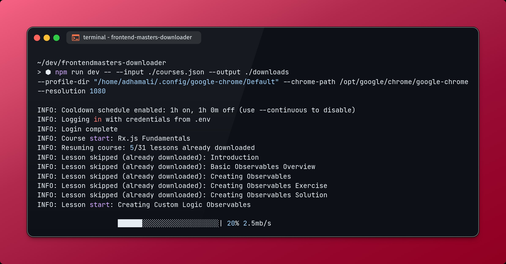

# Frontend Masters Downloader



Download your Frontend Masters courses for offline reference by behaving like a real user session (slower, safer).

This project requires a paid Frontend Masters membership. Frontend Masters does not provide an official offline download option. This tool is for educational purposes only and must comply with the [Frontend Masters Terms of Use](https://frontendmasters.com/company/terms/)

## Why this is different

Many open-source attempts to download Frontend Masters content trigger warnings or account suspensions because they download too aggressively. This tool prioritizes account safety by mimicking normal user behavior, adding rate limits, and keeping concurrency low. It takes longer, but it is far less likely to get your account flagged.

## Safety first

- Default rate-limited run windows (1 hour on, 1 hour off) to avoid bursts.
- Low segment download concurrency (1) by design.
- Resumable behavior: re-runs skip completed lessons and remove incomplete files before retrying.
- Headless mode available (recommended for Docker).

## Features

- Works through a real browser session (Playwright) to get HLS playlists.
- Resolution selection (1080, 720, 480, 360) with graceful fallback.
- Idempotent downloads: resume after interruption.
- Course metadata saved alongside lessons.

## Requirements

- Node.js >= 20
- A valid Frontend Masters account
- FFmpeg installed locally (or use Docker)

## Install (local)

```bash
npm install
```

## Configure

Create a .env file with your Frontend Masters credentials:

```bash
FRONTENDMASTERS_USERNAME=your@email.com
FRONTENDMASTERS_PASSWORD=your-password
```

Create a courses.json file (see courses.json.example):

```json
[
	{
		"title": "Front-End System Design",
		"url": "https://frontendmasters.com/courses/frontend-system-design/"
	}
]
```

## Run (local)

```bash
npm run dev -- --input ./courses.json --output ./downloads
```

Or run the compiled build:

```bash
npm run build
npm start -- --input ./courses.json --output ./downloads
```

## CLI options

```
--input <path>              Input JSON file (default: ./courses.json)
--output <dir>              Output directory (default: ./downloads)
--chrome-path <path>        Custom Chrome executable path
--concurrency <number>      Parallel lesson downloads (default: 2)
--headless                  Run browser headless
--dry-run                   Print what would be downloaded
--playlist-timeout-ms <ms>  Timeout waiting for HLS playlist (default: 15000)
--lesson-timeout-ms <ms>    Page navigation timeout (default: 30000)
--resolution <height>       1080 | 720 | 480 | 360
--continuous                Disable run/pause schedule
--run-duration-ms <ms>      Run window duration (default: 3600000)
--pause-duration-ms <ms>    Pause window duration (default: 3600000)
```

## Examples

Download at 720p with headless mode:

```bash
npm run dev -- --input ./courses.json --output ./downloads --resolution 720 --headless
```

Run continuously (no rate-limit schedule):

```bash
npm run dev -- --continuous
```

## Docker

Build the image:

```bash
docker build -t fm-downloader .
```

Run with mounted inputs and outputs:

```bash
docker run --rm \
	--env-file ./.env \
	-v "$PWD/courses.json:/app/courses.json" \
	-v "$PWD/downloads:/app/downloads" \
	fm-downloader \
	--input /app/courses.json \
	--output /app/downloads \
	--headless
```

## Output layout

```
downloads/
	<course-slug>/
		course.json
		<lesson-index>-<lesson-title>.mp4
```

## Notes

- This project was built as a practical exercise in working with HLS streams (inspired by recent experience with HLS.js), but implemented from scratch for server-side automation.
- If you interrupt a run, just start it again. Completed lessons are skipped automatically.
- If a requested resolution is not available, the highest available variant is used.
- Use --headless for Docker or CI environments.
- The project is tested against rate-limits. However, it's not battle-tested against bugs. So, feel free to open issues or PRs if you encounter any problems or have suggestions for improvement.
